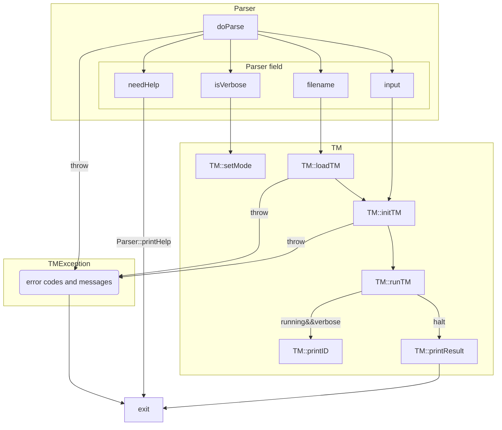

# FLA课程实验报告

> 201220154 王紫萁 201220154@smail.nju.edu.cn

## 设计思路

### 整体规划

整个模拟器可以由三部分构成，分别为命令行解析器（`parser`），图灵机加载器（`interpreter`），以及图灵机模拟器（`simulator`），其中后两者可以集成为`TM`，加载器作为`TM`的定义初始化模块，模拟器作为`TM`的状态转移模块。

### parser

parser对用户的输入进行第一次过滤。并获取命令行中的可选参数，.tm文件名，以及tm输入字符串。在这一层上的错误处理是较为简单的，比如，parser不会检查文件是否存在，或者输入串是否存在（均留给加载器处理），他只会查看可选参数并将文件名和输入串加载到自己的成员变量中。当`-h|--help`被设置或者参数个数不正确时，parser的`ready`被设置为false，加载器也不会运行。所有命令行相关错误均报告`ERROR_CMD`

​	可选参数：`-h|--help`, `-v|--verbose`

### interpreter

作为`TM`的组成部分之一，加载器（入口为函数`loadTM`）从.tm文件中读取图灵机定义，并将各种符号定义，状态定义，转移函数等加载到自己的成员变量中。当然顺利的话不需要报任何错误，但是为了满足用户友好的要求，需要针对各种不同的情况`throw`可能的定义错误。包括但不限于由以下`ERROR_CODE`定义的错误

```c++
		ERROR_FILE_NOT_FOUND,   // tm file not found
    ERROR_SYNTAX,           // syntax errors
    ERROR_UNDEF,            // symbol used before defined
    ERROR_DEF,              // definition error
    ERROR_STATE,						// state doesn't exist
    ERROR_DElTA,            // transfer function error
    ERROR_TAPEMIS,          // tape symbol not found
    ERROR_INMIS,            // input symbol not found
```

这些错误代码都会由搭载在`TMException`中在出错点由TM抛出，由`loadTM`打印错误信息并直接返回错误码，如果没有错误返回0

其中每一个错误码可能包含多种错误，比如语法错误就包括：缺失必要的`{}`，符号集的符号多于一个字符，符号定义不是受支持的ASCII符号，定义没有assign（`=`）……可见错误处理一直是让人头疼的部分。余下错误类型已在注释中表示，也可以参考源码（`TM.c`）。

字符串解析的部分较为琐碎繁杂，这里为了提升加载效率，仅在状态集定义处采用正则匹配其中的每一个状态。每一行的解析由字符串的[Trimming](https://en.wikipedia.org/wiki/Trimming_(computer_programming))和[Tokenize](https://en.wikipedia.org/wiki/Lexical_analysis#Token)函数族配合完成，实现方法主要使用了标准库中的字符串`erase`和`find_first/last_(not)_of`系列函数，具体实现细节可参考源码。

解析成功后定义图灵机的七元组$Q = \{Q,\Sigma, \Gamma,\delta.q_0,B,F\}$也被结构化加载到各成员变量中。关于容器选择，其中集合相关部分选用`unordered_set`，迁移函数集选择以状态为键，`Transfer`类为值的`unordered_multimap`。重要的结构——纸带采用`list<idx, charactor>`实现（这种实现在理论上可以双边无穷长）

注：所有错误代码均会作为程序退出时的返回值

### simulator

simulator的错误处理就较为轻松了，因为不涉及复杂字符串相关的error，唯一的输入字符串的错误可以调用前一节中实现好的`checkSymExistence`检查。涉及到的错误类型如下:

```c++
		ERROR_INMIS,            // input symbol not found
    ERROR_START,            // starts in a bad state, not ready/ is already running
    ERROR_INPUT,            // input string error
```

通过层层检查后，我们的图灵机终于终于（大声）可以运行起来了！接下来就是傻瓜式地根据当前状态和纸带字符匹配转移函数函数并写纸带和状态转移了。需要注意一点的是，由于我们的纸带采用链表实现，因此当读写头到达链头或链尾时要注意新建节点和下标顺序的维护。到达接受状态后，`accepted`被设置为`true`。图灵机停机后，如果该语言被接受（理论课的学习中我们知道大部分图灵机都接受$\Sigma^*$，但判断一下更严谨）就输出第一条纸带的内容。

模拟完成，任务结束了！。。。？还没有，字符串处理又来了——`verbose`模式下的`ID`打印也令人头疼。为了使格式对其，需要计算每个`index`的长度，以及表头（`Step:` ,`Index0 :` , `Tape0 :`）的长度。具体过程就不多讲了，总的来说要确保表头的`:`处于同一列，这样才方便纸带字符和下标的左对齐打印以及读写头位置的打印。

### cases

#### 循环右移一位

注：以下所言带头均指第一个有效字符

直接讲思路：用两条纸带`tape0，tape1`，分别具有读写头`head0, head1`，输入为空，进入接受状态，并停机。否则：

1. `head0`移到最后一个字符，copy到`tape1`，并置为`_`，`head0`左移一位，同时`head1`右移到下一个空位置。
2. `head0`移到头，将剩余的字符串从`tape0`拷贝到`tape1`。
3. 此时`head1`上放着结果，再将两个读写头一起移到带头，将带1拷贝到带0

#### 平方长度串组成语言的成员性

该例较为复杂，理论依据：$1+3+5+……+(2n-1) = n^2$。两条带，带0，带1。用带1记录1，3，5，7这些计数，即在任一时刻，带1上的标记`M`的个数。带2上存放输入与输出。两个带头所指字符有以下四种情况

1. head0 = ‘\_’ 且 head1 = ‘M’，打印false
2. head0 = ‘1’且 head1 = ‘M’，两个带头一起右移
3. head0 = ‘1’且head1 = ‘_’，在带1上放两个M，head1移到带头
4. head0 = ‘\_’ 且head1 = ‘\_’，打印true

举个栗子

Input = 111111111（9个）

```
==================== RUN ====================
Step   : 0
State  : empty
Index0 : 0 1 2 3 4 5 6 7 8 
Tape0  : 1 1 1 1 1 1 1 1 1 			
Head0  : ^
Index1 : 0 
Tape1  : _ 
Head1  : ^
---------------------------------------------
Step   : 1
State  : start
Index0 : 0 1 2 3 4 5 6 7 8 
Tape0  : 1 1 1 1 1 1 1 1 1
Head0  : ^
Index1 : 0 
Tape1  : M 										如果输入不为空，放一个M，代表1
Head1  : ^
---------------------------------------------
Step   : 2
State  : judge
Index0 : 0 1 2 3 4 5 6 7 8 
Tape0  : 1 1 1 1 1 1 1 1 1 			
Head0  :   ^
Index1 : 0 1 
Tape1  : M _ 									
Head1  :   ^									符合情况3
---------------------------------------------
...
---------------------------------------------
Step   : 8
State  : at_head1
Index0 : 0 1 2 3 4 5 6 7 8 
Tape0  : 1 1 1 1 1 1 1 1 1 
Head0  :   ^
Index1 : 0 1 2 
Tape1  : M M M 								放两个标记并将head1移到带头，符合情况2，一起右移
Head1  : ^
---------------------------------------------
...
---------------------------------------------
Step   : 11
State  : at_head1
Index0 : 0 1 2 3 4 5 6 7 8 
Tape0  : 1 1 1 1 1 1 1 1 1 
Head0  :         ^
Index1 : 0 1 2 3 
Tape1  : M M M _ 							进入下一轮
Head1  :       ^
---------------------------------------------
...
---------------------------------------------
Step   : 25
State  : at_head1
Index0 : 0 1 2 3 4 5 6 7 8 9 
Tape0  : 1 1 1 1 1 1 1 1 1 _ 
Head0  :                   ^
Index1 : 0 1 2 3 4 5 
Tape1  : M M M M M _ 					符合情况4，打印true
Head1  :           ^
---------------------------------------------
```

## 完成度和遇到的问题

能够查找常见错误以及错误输出，完成了图灵机解析器以及模拟器并尽己所能做了优化，包括但不限于匹配优化与循环优化等。

```
(base) user@host bin % ./turing -v ../programs/case2.tm 101010     
Input: 101010
==================== ERR ====================
error: '0' was not declared in the set of input symbols
Input: 101010
        ^
```

另外主要的函数声明和成员都写了==详细的注释==，方便zjgg检查。

下面列出主要类与数据流转移情况




问题：主要还是图灵机的转移函数不太好想，像case2结合网络上提示花费大量时间才能写出不出错的图灵机，属实不容易。

## 感想

虽然这学期期末堪称恐怖，但至少在本项目上也能挤出时间将之完善到自己满意的程度，给自己比个花。

## 课程意见

一句话：blgg好耐心，讲解好透彻，zjgg们批改作业也非常详细，实验也非常有意思。

如果要说意见，可不可以把作业分散到每周布置两三题，这样既能多做，期末的压迫感还能减少一丝。

最后真的要感谢blgg和zjgg的一路陪伴和耐心解答，这么难的课也能收获颇丰。也感谢自己的付出，祝福自己拿个好成绩（疯狂明示）。


